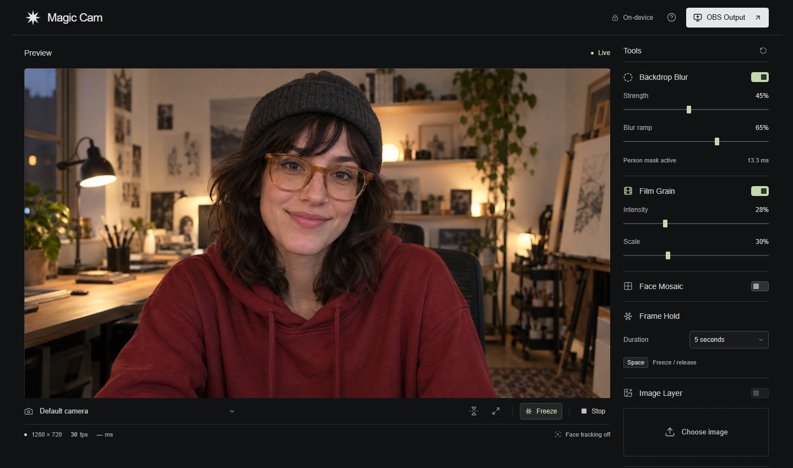
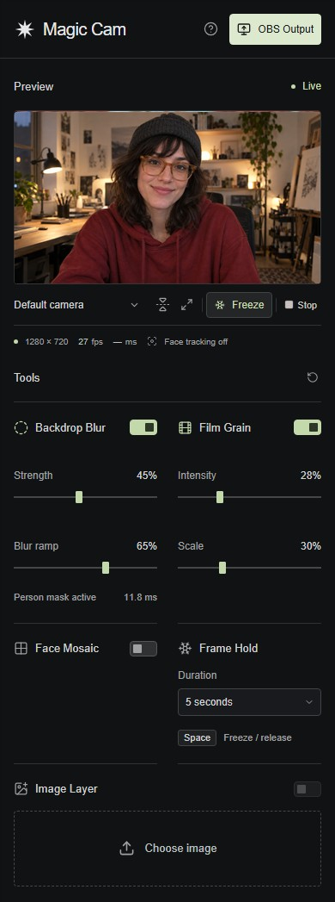

# Magic Cam

On-device webcam processing for OBS, built with React, Canvas 2D, and MediaPipe. Frames and uploaded images stay in the browser; there is no video backend, analytics, or cloud inference.

[Open Magic Cam](https://0xdeadbife.github.io/magic-cam/)



## What it does

- **Backdrop Blur** isolates the person and graduates blur across the background.
- **Film Grain** adds fine monochrome texture with adjustable intensity and scale.
- **Face Mosaic** pixelates the tracked face with adjustable block size.
- **Frame Hold** freezes the final composition for a timed duration or until release. Press `Space` to freeze and release.
- **Image Layer** overlays a local image or replaces the camera feed, with position, scale, and opacity controls.
- Camera selection, mirroring, reset, and measured render FPS and inference duration.
- A clean shared output window for OBS, without a second camera or model pipeline.

Effects can be combined. Reset returns to the live, unmodified camera.

Visual settings and hold duration are remembered for this site in the browser. Uploaded images remain session-only and are released when removed or the page closes.

### Compact controls

The studio also fits a narrow floating window while another app stays on the main display.



## Run locally

Requires Node 22.12 or newer and a current desktop Chrome or Edge browser.

```sh
git clone https://github.com/0xdeadbife/magic-cam.git
cd magic-cam
npm ci
npm run dev
```

Open [http://127.0.0.1:5173/](http://127.0.0.1:5173/). The first development run downloads the MediaPipe model files and copies the matching WASM assets into `public/`; later runs use those local files.

## Use with OBS

1. Start the camera and set up the effects in Magic Cam.
2. Click **Output** and allow the popup.
3. Add a **Window Capture** source in OBS and select **Magic Cam — Clean Output**.
4. Fit the source without stretching it. Crop browser chrome if your capture method includes it.
5. Start **OBS Virtual Camera** and select it in the destination app.

Keep the studio and output windows open and unminimized. The output receives the existing composited canvas stream, so controls stay responsive and no second webcam request is made. OBS Browser Source is not used for camera access. Audio remains an OBS setting.

## GitHub Pages

The deployed app is at [0xdeadbife.github.io/magic-cam](https://0xdeadbife.github.io/magic-cam/).

The workflow in [`.github/workflows/pages.yml`](./.github/workflows/pages.yml) builds and tests the production bundle before publishing `dist/`. For a new fork, set **Settings → Pages → Source** to **GitHub Actions**, then push the default branch.

The build uses relative application paths, including Workers, models, WASM files, icons, and the output popup. This keeps it working under a repository subpath such as `/magic-cam/`.

## Pipeline

```text
webcam or replacement image
  → background blur
  → face effects
  → film grain and image overlays
  → final-frame hold
  → studio preview and shared OBS output
```

- `src/core/capture.ts` owns camera acquisition, source changes, disconnects, and track cleanup.
- `src/core/tracking.ts` runs reduced-resolution face tracking with one inference job in flight.
- `src/core/segmentation.ts` and `src/core/background-blur.ts` build and composite the person matte.
- `src/core/effects.ts` defines the extensible effect stages and image layer.
- `src/core/studio.ts` schedules rendering, freezes the final composition, and shares the output stream.
- `src/ui/` contains the React controls. Frame pixels and landmarks never enter React state.

Rendering only processes fresh video frames or effect changes. Face tracking uses a 320-pixel-wide input and person segmentation uses a 384-pixel-wide input, both capped at 15 Hz. Busy flags prevent stale inference work from queuing. Models load only when needed and are released with camera tracks, render loops, decoded images, and buffers on stop or unmount.

`Effect` exposes a render stage, frame callback, and optional cleanup. A future one-shot overlay can keep its own lifetime and use the normalized face anchor without changing the capture or tracking layers.

## Checks

```sh
npm run build
npm test
npx playwright install chromium
npm run test:e2e
npm run test:pages
```

The browser suite covers camera lifecycle, real MediaPipe Worker inference, fallback tracking, Face Mosaic, Backdrop Blur, Film Grain, Image Layer, Frame Hold, keyboard control, saved settings, responsive layout, and the shared output stream. `test:pages` serves the production bundle from a repository-style subpath and rejects unexpected external requests.

A physical webcam and OBS still need a manual pass for permissions, device switching, fast movement, difficult lighting, background-window throttling, capture cropping, and the final virtual-camera handoff. Face Mosaic is a visual effect, not an anonymity guarantee.

## MediaPipe assets

MediaPipe Tasks Vision is pinned to `0.10.32`; the Pages test verifies the local-only runtime path. The app uses Google's [Face Landmarker](https://developers.google.com/edge/mediapipe/solutions/vision/face_landmarker/web_js) and [Image Segmenter](https://developers.google.com/edge/mediapipe/solutions/vision/image_segmenter/web_js) models. The screenshots use a fictional portrait created for this repository.
